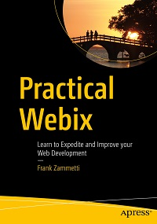

# Apress Source Code

This repository accompanies [*Practical Webix*](http://www.apress.com/9781484233832) by Frank Zammetti (Apress, 2018).

[comment]: #cover

Download the files as a zip using the green button, or clone the repository to your machine using Git.

## Releases

Release v1.0 corresponds to the code in the published book, without corrections or updates.

## Contributions

See the file Contributing.md for more information on how you can contribute to this repository.

## A Note from the Author, January 15, 2018

This is the source bundle for the book *Practical Webix* by Frank W. Zammetti.  
Each chapter that has code associated with it has its own directory, and then
the two apps that are built later in the book, wxGame and wxPIM, have their own
directories. The wxPIM directory contains subdirectories that chronologically
match the chapters over which the app is built.

Note that the code in this book is only tested to work with the included version
of Webix (4.4 GPL).  It all SHOULD work with newer versions, but it's not
guaranteed.

Thanks for reading!
Frank
